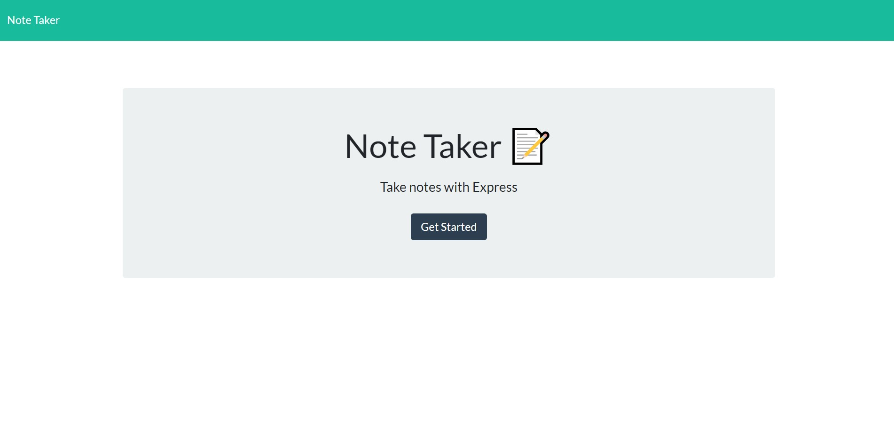
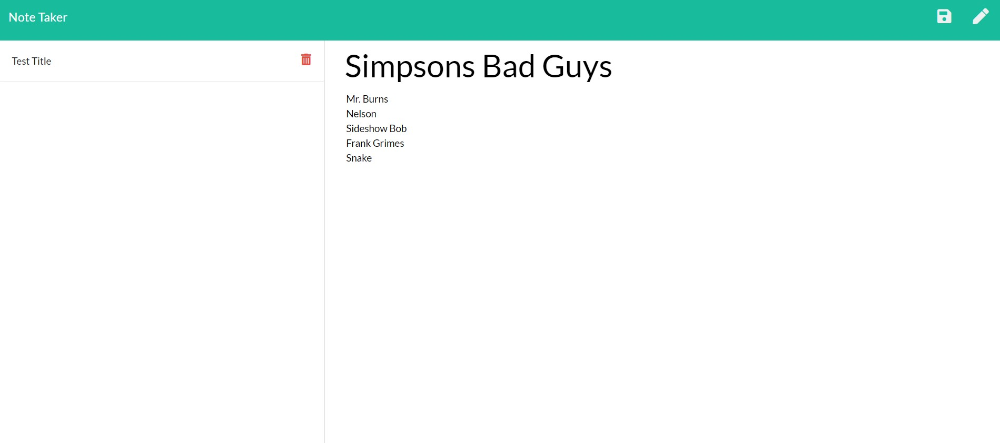
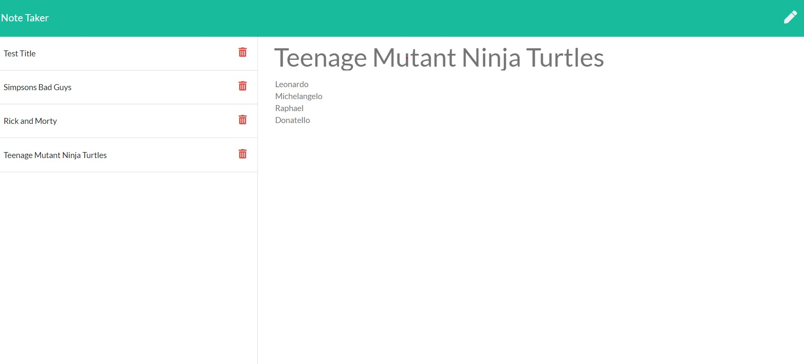
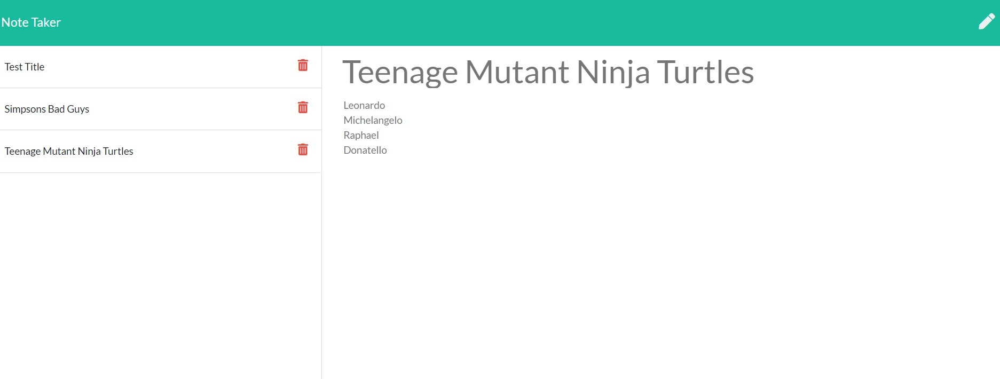

# Note-Taker Unit 11 Express Homework: Note Taker

https://week-11-note-taker.herokuapp.com/

## Description

The purpose for this project is to understand the processes involved in a server-side request, and how they interact with a client. This application writes, deletes, and saves notes by utlizing ECMAScript 6 and Express. Also useful in development was Postman, which tracked the GET and POST requests pertinent to functionality. The application was deployed using Heroku.

It was our job to create a server that interacted with JSON database. By importing specific npm packages, we could make routes with attached listeners, and respond with the proper data.

## User Story

AS A user, I want to be able to write and save notes

I WANT to be able to delete notes I've written before

SO THAT I can organize my thoughts and keep track of tasks I need to complete

## Screenshots

## Business Context

For users that need to keep track of a lot of information, it's easy to forget or be unable to recall something important. Being able to take persistent notes allows users to have written information available when needed.

## Challenges

A considerable time was spent determining why the application deletes notes on my local machine, but does not as a deployed application. 
